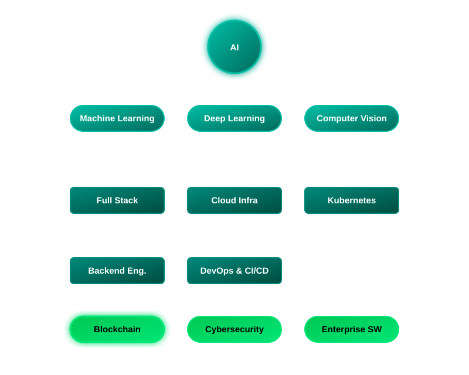

<!-- ========================================= -->
<!--         PRANESH S - GITHUB PROFILE        -->
<!--             PART 1 OF README              -->
<!-- ========================================= -->

<div align="center">


</div>

---

<div align="center">

## 👤 Who Am I


</div>

---

## 📝 About Me

I am a **Software Development Team Lead** passionate about designing **secure, scalable, and intelligent software solutions**. My work spans **Artificial Intelligence, Cybersecurity, Blockchain, Cloud Computing, and Full-Stack Development**, where I build enterprise-grade applications that solve real-world business challenges.

With experience leading cross-functional teams and delivering production-ready systems, I enjoy architecting solutions that combine **security, performance, automation, and modern engineering practices**.

### ✨ Specialties
<div>
     
</div>

### 💼 Open To

<div>
<br>
&nbsp;&nbsp;├── <br>
&nbsp;&nbsp;├── <br>
&nbsp;&nbsp;├── <br>
&nbsp;&nbsp;├── <br>
&nbsp;&nbsp;└── 
</div>

### 🎯 Current Mission
> *Building scalable enterprise software while integrating Artificial Intelligence, Cloud Computing, Blockchain, and Cybersecurity into modern business solutions.*

---

## 🔗 Connect

<div align="center">
<a href="https://github.com/pranesh-fortumars"></a> <a href="https://www.linkedin.com/in/pranesh-s-ps34101136/"></a> <a href="mailto:pranesh.se22@bitsathy.ac.in"></a> <a href="https://github.com/pranesh-fortumars"></a>
</div>

---

## 🐙 GitHub Analytics

<div align="center">
  
</div>

---

## 📊 GitHub Metrics

<div align="center">


</div>

---

## 🛠️ Tech Stack

## 💻 Programming Languages

<div align="center">


</div>

---

## 🎨 Frontend Development

<div align="center">


</div>

---

## ⚙ Backend Development

<div align="center">


</div>

---

## 🗄 Databases

<div align="center">


</div>

---

## ☁ Cloud & DevOps

<div align="center">


</div>

---

## ⛓ Blockchain

<div align="center">


</div>

Ethereum • Smart Contracts • DApps • Web3

---

## 🤖 Artificial Intelligence

<div align="center">


</div>

Machine Learning • Deep Learning • Computer Vision

---

## 🔐 Cybersecurity

<div align="center">


</div>

---

<div align="center">

## ⚡ *"Engineering Secure, Intelligent, and Scalable Digital Solutions."*

</div>

<!-- END OF PART 1 -->

<!-- ========================================= -->
<!--         PRANESH S - GITHUB PROFILE        -->
<!--             PART 2 OF README              -->
<!-- ========================================= -->

## 📊 Expertise

## 📊 Core Expertise

| Domain | Proficiency | Details |
|:-------|:-----------:|:--------|
| 🔐 Cybersecurity | ⭐⭐⭐⭐⭐ | Penetration Testing, Digital Forensics, Threat Intelligence, Secure SDLC, OWASP Top 10, MITRE ATT&CK |
| 🤖 Artificial Intelligence | ⭐⭐⭐⭐⭐ | Machine Learning, Deep Learning, TensorFlow, OpenCV, Intelligent Automation |
| ⛓ Blockchain | ⭐⭐⭐⭐⭐ | Ethereum, Solidity, Smart Contracts, Web3, Decentralized Applications |
| ☁ Cloud & DevOps | ⭐⭐⭐⭐☆ | AWS, Azure, Docker, Kubernetes, Jenkins, CI/CD |
| 💻 Full Stack Development | ⭐⭐⭐⭐⭐ | React.js, Next.js, FastAPI, Django, Flask, REST APIs |
| 👨‍💼 Technical Leadership | ⭐⭐⭐⭐⭐ | Agile Development, Sprint Planning, Code Reviews, Architecture, Team Management |

---

## 🚀 Featured Projects

# 🚀 Featured Projects

---

<details open>

<summary>

## 🗳 Blockchain-Enabled Decentralized Electoral Governance System

</summary>

### Overview

Designed and developed a **secure Ethereum-powered electronic voting platform** that ensures transparency, voter anonymity, and tamper-resistant elections.

| Category | Details |
|-----------|---------|
| **Role** | Project Lead |
| **Technology** | Ethereum, Solidity, React, Web3 |
| **Focus** | Blockchain Security |
| **Architecture** | Smart Contracts + Decentralized Voting |
| **Impact** | Secure Digital Election Platform |

### Highlights

- Secure voter authentication
- Blockchain-based vote storage
- Smart contract powered election management
- End-to-end transparency
- Tamper-proof vote recording
- Cryptographic hashing
- Gas optimized smart contracts

</details>

---

<details>

<summary>

## 🛡 AI-Driven Cyber Threat Intelligence & Detection Framework

</summary>

### Overview

An AI-powered cyber threat detection framework capable of identifying malicious activity across cloud and blockchain environments.

| Category | Details |
|-----------|---------|
| **Technology** | Python, TensorFlow, OpenCV |
| **Domain** | Cybersecurity + AI |
| **Focus** | Threat Detection |
| **Models** | Machine Learning |

### Features

- Intelligent anomaly detection
- Behavioral analysis
- Threat prediction
- Network traffic monitoring
- Cloud security analytics
- AI-assisted cyber defense

</details>

---

<details>

<summary>

## 📜 Cryptographic Blockchain Document Authentication Platform

</summary>

### Overview

Blockchain-powered document verification platform ensuring authenticity and integrity of digital documents.

| Category | Details |
|-----------|---------|
| **Technology** | Solidity, Ethereum, SHA Hashing |
| **Purpose** | Document Verification |
| **Security** | Blockchain Validation |

### Features

- Document fingerprint generation
- Immutable blockchain storage
- Smart contract verification
- Tamper detection
- Secure verification portal

</details>

---

<details>

<summary>

## 🤟 Real-Time Sign Language Recognition

</summary>

### Overview

A deep learning powered application capable of recognizing hand gestures in real time using computer vision.

### Tech Stack

TensorFlow • CNN • OpenCV • Python

### Features

- Live gesture detection
- Real-time prediction
- High accuracy CNN model
- Computer vision pipeline
- Accessibility focused solution

</details>

---

<details>

<summary>

## 💼 HireFlow - Recruitment Management & ATS

</summary>

### Overview

Enterprise Recruitment Management System developed for streamlining hiring workflows and candidate management.

### Features

- Applicant Tracking
- Resume Management
- HR Dashboard
- Interview Scheduling
- WhatsApp Automation
- Candidate Analytics

</details>

---

## 💼 Experience

# 💼 Professional Experience

---

<details>
<summary>

## 👨‍💼 Software Development Team Lead

</summary>

### Fortumars AI Technologies and Business Solutions Pvt. Ltd.

**March 2026 – Present**

#### Responsibilities

- Leading a team of **15 software developers**
- Managing **8 enterprise software projects**
- Conducting architecture discussions
- Sprint planning & Agile execution
- Performing code reviews
- Mentoring junior developers
- Stakeholder communication
- Software quality assurance
- Deployment planning
- Technical leadership

### Projects Delivered

- ERP Systems
- CRM Platforms
- HRMS
- Hiring Portal
- Finance Management
- Voice Billing Platform
- SaaS Applications
- Business Automation Software

**Skills**

`Leadership`
`Architecture`
`React`
`FastAPI`
`Cloud`
`DevOps`
`Agile`

</details>

---

<details>
<summary>

## 💻 Software Development Intern

</summary>

### Fortumars AI Technologies and Business Solutions Pvt. Ltd.

**Aug 2025 – Feb 2026**

### Responsibilities

- ERP Development
- CRM Development
- REST APIs
- Authentication Modules
- Database Design
- Bug Fixing
- Deployment
- Feature Development
- Performance Optimization

**Skills**

`React`
`FastAPI`
`MongoDB`
`PostgreSQL`
`Docker`

</details>

---

<details>
<summary>

## ☁ Deployment & Security Intern

</summary>

### Shadow Fox

**Aug 2024 – Nov 2024**

### Responsibilities

- AWS Deployment
- Azure Deployment
- Cloud Hardening
- Vulnerability Assessment
- Secure Infrastructure
- Cloud Security

**Skills**

`AWS`
`Azure`
`Linux`
`Security`
`Nmap`

</details>

---

<details>
<summary>

## 🔐 Cybersecurity Intern

</summary>

### Center for Cyber Security Studies & Research (CFCS2R)

**Apr 2024 – Jul 2024**

### Responsibilities

- Threat Intelligence
- Digital Forensics
- MITRE ATT&CK
- Incident Analysis
- Malware Investigation
- Security Research

**Skills**

`MITRE`
`Digital Forensics`
`Cybersecurity`
`Threat Hunting`

</details>

---

<details>
<summary>

## 🤖 Product Intern

</summary>

### NAS IO

**Jan 2024 – Apr 2024**

### Responsibilities

- Robotics Automation
- AI Research
- Product Development
- Technical Documentation
- Threat Detection

**Skills**

`AI`
`Robotics`
`Research`
`Automation`

</details>

---

## 🏆 Certifications

<div align="center">

| Certification | Organization |
|---------------|--------------|
| 🛡 Ethical Hacker Certification | Cisco Networking Academy |
| ⚔ Cyber Defense Strategies for Combating C2 Based Attacks | CyberWarFare Labs |
| 💻 Exploring Various Windows Persistence Techniques | CyberWarFare Labs |
| 🌐 WordPress Development | Udemy |
| 🏛 IEEE Member | IEEE |
| 👨‍💻 CSI Member | Computer Society of India |

</div>

---

## 📚 Research

## 📚 Research & Publications

| Title | Domain |
|-------|--------|
| Digital Bastion: AI-Driven Cybersecurity and Blockchain Security Systems | AI + Cybersecurity |
| AI in Nuclear Medicine: Automated Medicine Identification Using Artificial Intelligence | Artificial Intelligence |

<!-- ========================================= -->
<!--         PRANESH S - GITHUB PROFILE        -->
<!--     PART 5 - PREMIUM EXTRAS & WIDGETS     -->
<!-- ========================================= -->

<!-- 
## 🎓 Education

<div align="center">

## 🎓 Academic Journey

| Degree | Institution | Duration | Performance |
|:-------|:------------|:---------|:-----------:|
| **B.E. Information Science & Engineering** | **Bannari Amman Institute of Technology** | **2022 – 2026** | **CGPA: 8.20** |

</div>

---
-->

## 👨‍💻 Coding Profiles

<div align="center">

<a href="https://leetcode.com/u/praneshs616/">

</a>

<a href="https://www.geeksforgeeks.org/profile/praneser0n">

</a>

<a href="https://www.hackerrank.com/profile/pranesh_se22">

</a>

<a href="https://codeforces.com/profile/pranesh_S_136">

</a>

<a href="https://www.codechef.com/users/pranesh_s_136">

</a>

<a href="https://www.hackerearth.com/@pranesh117/">

</a>

</div>

---


<!--
## ⏳ Weekly Development Breakdown

<div align="center">

   
<br>
  

</div>

---
-->


## 🌍 Contribution World Map

<div align="center">
  
</div>

---

## 🏆 LeetCode Progress

<div align="center">
  
</div>

---

## 📚 Currently Reading

<div align="center">


</div>

---

## 🤝 Let's Collaborate

I'm always open to collaborating on projects involving:

<div align="center">


</div>

---

<details>
<summary><b>💼 Professional Services</b></summary>
<br>

<div align="center">
  
  
  
  
  <br>
  
  
  
  
</div>

</details>

---

<details>
<summary><b>⏳ Career Timeline</b></summary>
<br>

> **2026 • Software Development Team Lead**
> *Fortumars AI Technologies*
> - Leading Enterprise Software Projects
> - Managing Development Teams
> - AI + Cybersecurity + SaaS + Cloud

> **2025 • Software Development Intern**
> *Fortumars AI Technologies*

> **2024 • Deployment & Security**
> *Shadow Fox*

> **2024 • Product Intern**
> *NAS IO*

> **2024 • Cybersecurity Intern**
> *CFCS2R*

> **2022 • Started B.E**
> *Information Science & Engineering*

</details>

---

<details>
<summary><b>🎯 2026 Goals Tracker</b></summary>
<br>

<div align="center">

| 🏆 Goal | 📈 Status |
|:---|:---:|
|  Build 10+ Enterprise Applications |  |
|  Publish AI Projects |  |
|  Open Source Cybersecurity Tools |  |
|  Launch Portfolio Platform |  |
|  Advanced Cloud Certifications |  |
|  Publish Technical Blogs |  |
|  Speak at Tech Conferences |  |
|  Mentor Developers |  |

</div>
</details>

---

<details>
<summary><b>🌐 Tech Ecosystem</b></summary>
<br>

<div align="center">
  
</div>

</details>

---

<div align="center">

## 🚀 *"Code with Purpose • Build with Passion • Secure by Design."*

</div>

<!-- END PART 5 -->


<!-- 
## ⏳ WakaTime Workflow

```
.github/workflows/waka.yml
```

```yaml
name: Waka Readme
on:
  schedule:
    - cron: "0 0 * * *"
  workflow_dispatch:
jobs:
  update-readme:
    runs-on: ubuntu-latest
    permissions:
      contents: write
    steps:
      - uses: athul/waka-readme@master
        with:
          WAKATIME_API_KEY: ${{ secrets.WAKATIME_API_KEY }}
```
-->

---


<details>
<summary><b>🏷️ GitHub Topics & Core Skills</b></summary>
<br>

<div align="center">
  
  
  
  
  
  <br>
  
  
  
  
  
  <br>
  
  
  
  
  
  <br>
  
  
  
  
</div>

</details>

---

## 🧩 Interactive Skills Graph

<div align="center">
  
</div>

---

<!--
## 🔮 Future Additions

## 🚀 Future Integrations

- 🤖 AI Chat Assistant
- 🧠 MCP Projects
- 🛰️ Kubernetes Dashboard
- ☁ AWS Certifications
- 🎯 Hackathon Timeline
- 📰 Research Publications Feed
- 🎤 Conference Talks
- 🏆 Awards Showcase
- 📜 Resume Download
- 🖼️ Interactive 3D Portfolio
- 📦 Docker Hub Stats
- 📊 GitHub Insights
- 🌐 Portfolio Live Status
- 📈 Coding Heatmap
- 🧩 Interactive Skills Graph
-->


---

## 🏅 Achievements

<div align="center">

| 🏆 Achievement | Description |
|---------------|-------------|
| 🥇 Code Conquest Leaderboard | Recognized for consistent competitive coding performance |
| 🛡 TN Skills Level-2 Cyber Security Competition | State-level Cybersecurity Competition Participant |
| 🔐 Multiple Cybersecurity Internships | Cloud Security, Threat Intelligence, Digital Forensics |
| 📚 Published Research | AI, Blockchain & Cybersecurity Research Publications |
| 🎯 Technical Communities | Active contributor to workshops, webinars & research initiatives |

</div>

---

<div align="center">

## 🚀 *"Transforming Ideas into Secure, Intelligent & Scalable Software Solutions."*

</div>

<!-- END OF PART 2 -->

<!-- ========================================= -->
<!--         PRANESH S - GITHUB PROFILE        -->
<!--             PART 3 OF README              -->
<!-- ========================================= -->

## 📈 GitHub Analytics

<div align="center">


</div>

---

## 🏆 Top Languages

<div align="center">


</div>

---

## 🔭 Development Overview

<div align="center">

| 🚀 Focus | 💡 Status |
|----------|-----------|
| Enterprise Software | ██████████ 100% |
| Artificial Intelligence | █████████░ 90% |
| Cybersecurity | ██████████ 100% |
| Blockchain | █████████░ 90% |
| Cloud Computing | ████████░░ 80% |
| DevOps | ████████░░ 80% |
| Technical Leadership | ██████████ 100% |

</div>

---

## 🏆 GitHub Trophies

<div align="center">


</div>

---

## 📉 Activity Graph

<div align="center">


</div>

---

## 💻 Coding Statistics

<div align="center">

| Metric | Status |
|--------|--------|
| 💻 Full Stack Development | ██████████ |
| 🔐 Cybersecurity | ██████████ |
| 🤖 Artificial Intelligence | █████████ |
| ⛓ Blockchain | █████████ |
| ☁ Cloud Engineering | ████████ |
| ⚙ DevOps | ████████ |
| 👨‍💼 Leadership | ██████████ |

</div>

---

## 👨‍💻 Developer Summary

<div align="center">


</div>

---

## 📁 Repositories Per Language

<div align="center">


</div>

---

## ⚡ GitHub Productivity

<div align="center">


</div>

---

## 🌐 Technology Ecosystem

<div align="center">

### 🌐 Technologies I Enjoy Building With


</div>

---

## ⭐ Contribution Highlights

<div align="center">

| 📈 Area | Description |
|---------|-------------|
| 💼 Enterprise Development | Building ERP, CRM, ATS, HRMS & SaaS platforms |
| 🤖 AI Solutions | Intelligent automation & machine learning systems |
| 🔐 Cybersecurity | Secure software engineering & cloud security |
| ⛓ Blockchain | Smart contracts & decentralized applications |
| ☁ Cloud Platforms | AWS & Azure deployment pipelines |
| 👨‍💻 Team Leadership | Managing development teams and enterprise projects |

</div>

---

<details>
<summary>

## 📡 Current Status

</summary>

```yaml
developer:
  name: Pranesh S
  role: Software Development Team Lead
  organization: Fortumars AI Technologies and Business Solutions Pvt. Ltd.

  interests:
    - Artificial Intelligence
    - Cybersecurity
    - Blockchain
    - Enterprise Software
    - Cloud Computing

  currently_working_on:
    - ERP Systems & CRM Platforms
    - Voice Billing & SaaS Solutions

  currently_learning:
    - Large Language Models & AI Agents
    - Cloud Native Architecture
    - Advanced Kubernetes

  open_for:
    - AI & Cybersecurity Engineering
    - Technical Leadership
```

</details>

---

<div align="center">

## 📊 GitHub Development Journey

```text
Cybersecurity  ██████████████████████

AI & ML        ████████████████████

Blockchain     ███████████████████

Cloud          █████████████████

Leadership     ██████████████████████

Full Stack     ██████████████████████
```

</div>


<!-- END OF PART 3 -->

<!-- ========================================= -->
<!--         PRANESH S - GITHUB PROFILE        -->
<!--             PART 4 OF README              -->
<!-- ========================================= -->

## 🎯 Current Focus

<div align="center">

|  |  |
|:---:|:---:|
|  |  |
|  |  |
|  |  |

</div>

---

<details>
<summary><b>🗺️ Learning Roadmap</b></summary>
<br>
<div align="center">

| 🎯 Goal | Progress |
|----------|:-------:|
| Artificial Intelligence | 🟩🟩🟩🟩🟩 |
| Machine Learning | 🟩🟩🟩🟩⬜ |
| Deep Learning | 🟩🟩🟩🟩⬜ |
| Cybersecurity | 🟩🟩🟩🟩🟩 |
| Blockchain | 🟩🟩🟩🟩⬜ |
| Cloud Computing | 🟩🟩🟩🟨⬜ |
| Kubernetes | 🟩🟩🟨⬜⬜ |
| Agentic AI | 🟩🟨⬜⬜⬜ |

</div>
</details>

---

<details>
<summary><b>🔬 Research Areas</b></summary>
<br>
<div align="center">
         
</div>
</details>

---

<details>
<summary><b>❤️ Open Source Interests</b></summary>
<br>
<div align="center">
       
</div>
</details>

---

<details>
<summary><b>⏳ Daily Workflow</b></summary>
<br>
<div align="center">

| Phase | Activities |
|:---:|:---|
| ☀ **Morning** | Review Tasks • Team Standup • Architecture Planning |
| 💻 **Development** | Backend APIs • Frontend Features • Database Design • Testing • Debugging |
| 🚀 **Deployment** | Docker • GitHub • Cloud • Monitoring |

</div>
</details>

---


---

## 🐍 Snake Animation

<div align="center">

## 🐍 Contribution Snake

<picture>
  <source
    media="(prefers-color-scheme: dark)"
    srcset="https://raw.githubusercontent.com/pranesh-fortumars/a/output/github-contribution-grid-snake-dark.svg?sanitize=true"
  />
  
</picture>

</div>

---

## 🤝 Connect & Support

<div align="center">

### 💚 *Engineering Secure • Intelligent • Scalable Solutions*

**Thanks for visiting my profile! Let's build the future together:**

<a href="https://github.com/pranesh-fortumars"></a> <a href="https://github.com/pranesh-fortumars"></a> <a href="https://www.linkedin.com/in/pranesh-s-ps34101136/"></a> <a href="mailto:pranesh.se22@bitsathy.ac.in"></a>


**Made with ❤️ by Pranesh S**

</div>

<!-- ========================================= -->
<!--              END OF README                -->
<!-- ========================================= -->
